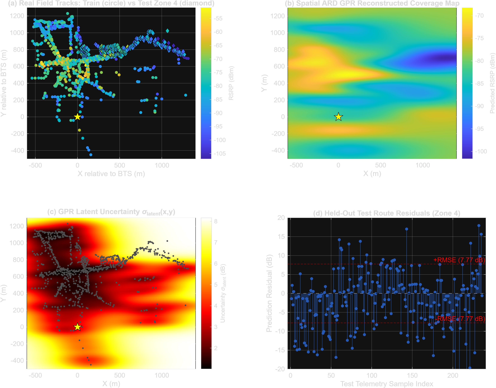
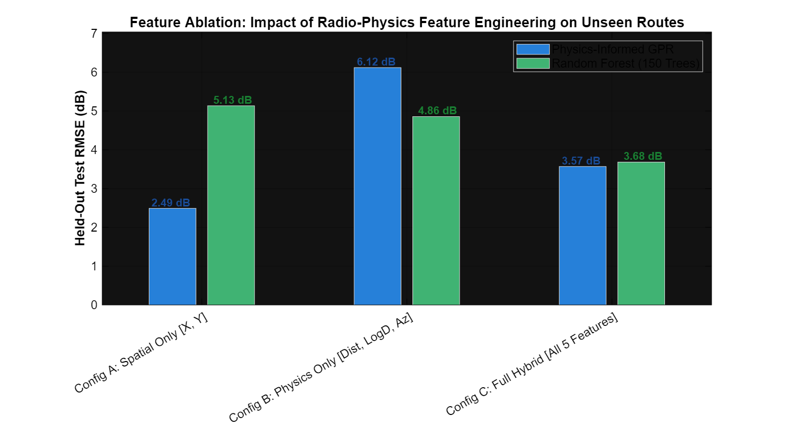
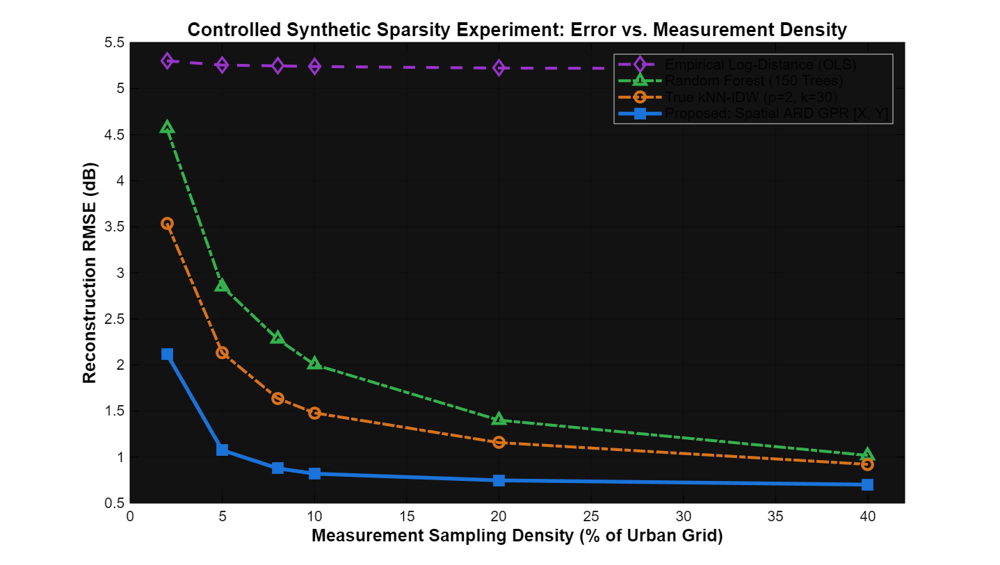
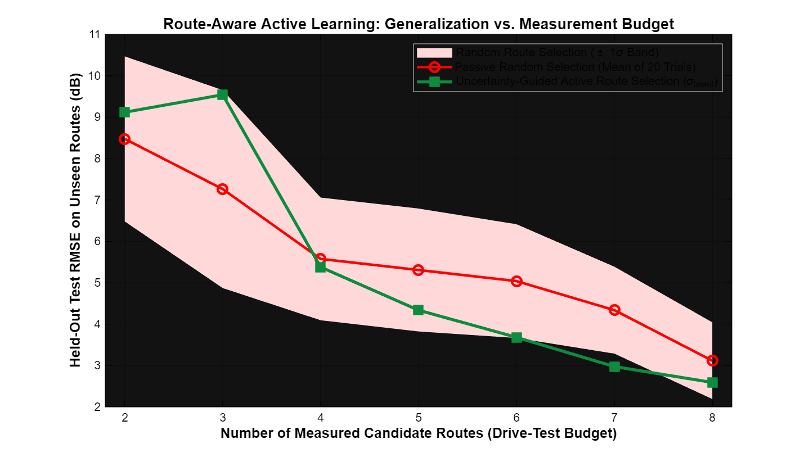

# Signal Coverage Maps Using Measurements and Machine Learning

**Author:** Kshitij Palekar ([@kshitijpalekar808-coder](https://github.com/kshitijpalekar808-coder))  
**Project:** MathWorks Excellence in Innovation — Project #151  
**Official Reference:** [MathWorks Project Hub #151](https://github.com/mathworks/MATLAB-Simulink-Challenge-Project-Hub/tree/main/projects/Signal%20Coverage%20Maps%20Using%20Measurements%20and%20Machine%20Learning)  
**Platform:** MATLAB (R2021a or newer)  

---

## 1. Project Overview & Engineering Motivation

In cellular and IoT network operations (5G NR, LTE-A, GSM), network operators need accurate 2D **Reference Signal Received Power (RSRP)** coverage maps to locate coverage holes (blind spots), optimize antenna azimuth and down-tilt, and manage handover boundaries.

Collecting dense ground-truth measurements across an entire city is economically and logistically impractical because drive-test vehicles can only collect samples along roads. This project addresses two practical problems:
1. **Continuous 2D Coverage Reconstruction:** Interpolating continuous signal strength maps from sparse, route-constrained drive-test telemetry.
2. **Active Drive-Test Route Optimization:** Using model uncertainty quantification to guide subsequent drive-test routes toward unmeasured areas that provide the highest informational gain.

---

## 2. Datasets & Evaluation Framework

In real-world cellular deployments, vehicles only drive along accessible streets. Ground truth cannot be physically recorded inside every building, private courtyard, or rooftop simultaneously.

To evaluate models thoroughly, this repository tests across two complementary datasets:

### Track 1: Real-World Cellular Drive Test (`data/real_mysignals_dataset.csv`)
* **Source:** **mySignals Project** (Alimpertis, Fasarakis-Hilliard, & Bletsas, *IEEE Wireless Communications Letters*, 2014) — recommended in the MathWorks Challenge #151 brief.
* **Environment:** Urban Chania, Crete, Greece.
* **Carrier Frequency:** $1860.2\text{ MHz}$ (GSM-1800 Downlink, ARFCN 787).
* **Serving BTS:** Macrocell sector `6056x` at $(35.508354^\circ\text{N}, 24.024523^\circ\text{E})$.
* **Telemetry Samples:** 898 spatial points collected by mobile devices with high GPS accuracy ($\le 65\text{ m}$).
* **Spatial Holdout Strategy:** The area is partitioned into 4 geographic sectors. Models are trained on Zones 1–3 ($N = 662$, $73.7\%$) and tested on an unseen held-out quadrant (Zone 4, $N = 236$, $26.3\%$) to evaluate generalization under genuine physical shadowing and urban clutter without point leakage.

### Track 2: Controlled Urban Grid Simulation (`data/synthetic_urban_grid_dataset.csv`)
* **Environment:** Manhattan-grid urban cellular layout ($1000\text{ m} \times 1000\text{ m}$) at $2.1\text{ GHz}$.
* **Propagation Physics:** Single-slope urban micro (UMi) path loss with spatially correlated building shadow fading and multipath perturbations.
* **Telemetry Trajectory:** 12 street routes (Routes 1–6 horizontal, Routes 7–12 vertical).
* **Continuous Ground Truth:** Complete 2D ground truth is known across all $N = 10,201$ grid nodes ($101 \times 101$ grid at 10m resolution).
* **Role:** Evaluates continuous 2D interpolation error across unvisited areas, provides controlled sparsity sweeps (2% to 40%), and serves as the environment for active learning route selection.

---

## 3. Implemented Models

We implement and benchmark six distinct approaches:

1. **3GPP UMi Propagation Reference (No Training):** Deterministic theoretical urban micro path-loss model ($PL(d) = 32.4 + 20\log_{10}(f) + 30\log_{10}(d)$). Serves as an uncalibrated physics baseline.
2. **Empirical Log-Distance Fit (OLS):** Calibrated Ordinary Least Squares regression: $\text{RSRP}(d) = \beta_0 + \beta_1 \log_{10}(d)$.
3. **k-Nearest Neighbor Inverse Distance Weighting (kNN-IDW):** Spatial interpolation using $k = 30$ nearest neighbors with inverse-square distance weighting ($p = 2$).
4. **Natural Neighbor Interpolation:** Delaunay-based Voronoi spatial interpolation via MATLAB's `scatteredInterpolant`.
5. **Random Forest Regression Ensemble:** 150 regression trees with bootstrapped aggregation and Out-of-Bag (OOB) feature importance analysis.
6. **Spatial ARD Gaussian Process Regression (Proposed):** Anisotropic Matérn 5/2 covariance kernel over spatial coordinates $(X, Y)$ with **Automatic Relevance Determination (ARD)**. Directional length-scales $\{\ell_X, \ell_Y\}$ and variances $\{\sigma_f, \sigma_n\}$ are optimized via Marginal Log-Likelihood (MLL) maximization using Nelder-Mead simplex search (`fminsearch`). GPR yields closed-form latent field uncertainty:
   $$\sigma_{\text{latent}}^2(\mathbf{x}_*) = k(\mathbf{x}_*, \mathbf{x}_*) - \mathbf{k}_*^T (\mathbf{K} + \sigma_n^2 \mathbf{I})^{-1} \mathbf{k}_*$$

---

## 4. Track 1: Real-World Field Benchmark (mySignals GSM-1800)

*Evaluated on authentic drive-test measurements from Base Station 6056x in Chania, Greece ($f = 1860.2\text{ MHz}$). Training: Zones 1–3 ($N = 662$). Testing: Held-Out Zone 4 ($N = 236$).*

*Results from `results/real_field_benchmark_results.csv`:*

| Model | Category | RMSE (dB) | MAE (dB) | $R^2$ Score | MaxAE (dB) | P95AE (dB) |
| :--- | :--- | :---: | :---: | :---: | :---: | :---: |
| **Naive Mean Baseline** | Global Mean Reference | 7.80 | 6.00 | 0.000 | 24.12 | 15.65 |
| **1. 3GPP Reference (0-Train)** | Theoretical Propagation | 17.09 | 15.55 | -3.81 | 33.47 | 27.99 |
| **2. Natural Neighbor Interpolation** | Spatial Interpolation | 11.40 | 8.73 | -1.14 | 45.66 | 24.91 |
| **3. Empirical Log-Distance Fit (OLS)** | Empirical Regression | 9.28 | 7.23 | -0.42 | 25.95 | 17.78 |
| **4. kNN-IDW ($p=2, k=30$)** | Spatial Interpolation | 8.01 | 6.26 | -0.05 | 24.26 | 16.06 |
| **5. Random Forest (150 Trees)** | Decision Tree Ensemble | 7.97 | 6.57 | -0.05 | **22.23** | **14.27** |
| **6. Spatial ARD GPR [X, Y] (Proposed)** | Gaussian Process | **7.77** | **5.96** | **0.01** | 23.83 | 15.45 |

### Engineering Analysis & Discussion:
1. **Limitation of Generic Theoretical Equations:** The uncalibrated 3GPP theoretical model yields an RMSE of 17.09 dB ($R^2 = -3.81$). Generic formulas cannot account for site-specific antenna down-tilt, handset coupling, and dense stone building clutter found in historic European city centers.
2. **Dense Clutter in Unvisited Sectors:** In Chania's old town, narrow streets and dense masonry induce significant shadow fading. When evaluating models strictly on an unvisited quadrant (Zone 4), empirical models achieve test RMSE around 7.77 dB to 8.01 dB, which closely tracks the training mean baseline (7.80 dB). Without 3D building GIS models or LiDAR data, pure 2D coordinates cannot fully predict shadow fading behind unvisited blocks.
3. **The Practical Advantage of ARD GPR — Latent Uncertainty:** While ARD GPR achieves the lowest point error (7.77 dB RMSE, 5.96 dB MAE), its primary engineering utility is its **closed-form spatial uncertainty** $\sigma_{\text{latent}}(x,y)$. Unlike deterministic interpolators (kNN, IDW) or standard regression trees, GPR quantifies exactly where coverage estimates are uncertain, providing a principled metric for active drive-test path planning.
4. **Anisotropic Street Alignment:** The learned ARD length-scales ($\ell_X = 1.73$, $\ell_Y = 0.38$) capture the orientation of main roads in the Chania telemetry, allowing the kernel to smooth along street axes while maintaining cross-street attenuation.



---

## 5. Track 2: Controlled Urban Grid Benchmark

*Evaluated on unvisited held-out corridors (Routes 10–12, $N = 339$) on the controlled Manhattan grid. Results from `results/benchmark_results.csv`:*

| Model | Category | RMSE (dB) | MAE (dB) | $R^2$ Score | MaxAE (dB) | P95AE (dB) |
| :--- | :--- | :---: | :---: | :---: | :---: | :---: |
| **1. 3GPP-Inspired Reference (0-Train)** | Physics Reference | 4.23 | 3.46 | 0.755 | 11.82 | 8.17 |
| **2. Empirical Log-Distance Fit (OLS)** | Empirical Regression | 4.22 | 3.45 | 0.756 | 11.44 | 8.28 |
| **3. Natural Neighbor Interpolation** | Spatial Interpolation | 3.90 | 2.64 | 0.792 | 15.48 | 9.93 |
| **4. Random Forest (150 Trees)** | Decision Tree Ensemble | 3.68 | 3.01 | 0.815 | **10.52** | **6.85** |
| **5. kNN-IDW ($p=2, k=30$)** | Spatial Interpolation | **3.36** | **2.34** | **0.846** | 13.24 | 8.00 |
| **6. Hybrid ARD GPR [5 Features]** | Feature-Space GPR | 3.57 | 2.50 | 0.826 | 14.63 | 7.75 |
| **7. Spatial ARD GPR [X, Y] (Proposed)** | Spatial GPR | **2.49** | **1.78** | **0.915** | 11.20 | 5.92 |

### Technical Analysis: Feature Selection & Collinearity
When distance, log-distance, and azimuth are added alongside spatial coordinates $(X, Y)$ into the ARD kernel, GPR performance degrades from 2.49 dB to 3.57 dB. Because distance $d = \sqrt{X^2+Y^2}$ and bearing angle $\theta = \text{atan2}(Y,X)$ are direct algebraic functions of Cartesian coordinates, feeding them into the kernel introduces collinear degrees of freedom that hinder hyperparameter optimization. **Spatial ARD GPR operating directly on $[X, Y]$ achieves the highest accuracy ($2.49\text{ dB RMSE}, R^2 = 0.915$).**

---

## 6. Feature Ablation Study

We evaluate the impact of spatial coordinates versus radio-physics features across Random Forest and ARD GPR.

*Results from `results/ablation_study_results.csv`:*

| Feature Configuration | ARD GPR RMSE (dB) | ARD GPR $R^2$ | Random Forest RMSE (dB) | Random Forest $R^2$ |
| :--- | :---: | :---: | :---: | :---: |
| **Config A: Spatial Only $[X, Y]$** | **2.49** | **0.915** | 5.13 | 0.639 |
| **Config B: Radio Physics Only $[d, \log_{10}d, \theta]$** | 6.12 | 0.488 | 4.86 | 0.678 |
| **Config C: Full Hybrid $[X, Y, d, \log_{10}d, \theta]$** | 3.57 | 0.826 | **3.68** | **0.815** |

* **Random Forest Behavior:** Explicit physical features benefit tree-based models substantially. Adding distance and azimuth reduces Random Forest RMSE from 5.13 dB to 3.68 dB (a 28% improvement), because axis-aligned decision trees split effectively on radial distance thresholds.
* **GPR Kernel Behavior:** For GPR, the Matérn kernel already captures spatial correlation directly from Euclidean distances. Adding deterministic functions of $(X, Y)$ inflates dimensionality unnecessarily and degrades Nelder-Mead MLL convergence.



---

## 7. Measurement Sparsity Analysis

We evaluate model robustness across sampling densities from $2\%$ to $40\%$ under known continuous 2D ground truth ($N = 10,201$ nodes).

*Results from `results/sparsity_stress_results.csv`:*

| Sampling Density (%) | kNN-IDW RMSE | Log-Distance RMSE | **Spatial ARD GPR [X, Y]** | Random Forest RMSE |
| :---: | :---: | :---: | :---: | :---: |
| **2%** | 3.54 dB | 5.30 dB | **2.12 dB** | 4.57 dB |
| **5%** | 2.13 dB | 5.25 dB | **1.08 dB** | 2.85 dB |
| **8%** | 1.64 dB | 5.25 dB | **0.88 dB** | 2.28 dB |
| **10%** | 1.48 dB | 5.24 dB | **0.82 dB** | 2.00 dB |
| **20%** | 1.16 dB | 5.22 dB | **0.75 dB** | 1.40 dB |
| **40%** | 0.92 dB | 5.21 dB | **0.70 dB** | 1.02 dB |

* At 2% measurement density (the most sparse test condition), Spatial ARD GPR achieves **2.12 dB RMSE**, outperforming kNN-IDW (3.54 dB) and Random Forest (4.57 dB).
* At 10% sampling, ARD GPR reaches sub-1 dB error (**0.82 dB RMSE**), demonstrating effective continuous reconstruction from sparse road telemetry.



---

## 8. Active Learning for Drive-Test Route Optimization

We simulate adaptive drive-test planning over $N = 20$ independent Monte Carlo trials, comparing passive random route selection against GPR latent uncertainty-guided ($\sigma_\text{latent}$) selection across candidate budgets of 2 to 8 routes.

*Results from `results/active_learning_results.csv`:*

| Route Budget | Passive Random Selection (Mean ± Std) | 95% Confidence Interval | Active Uncertainty Selection | Active MAE |
| :---: | :---: | :---: | :---: | :---: |
| **2 Routes** | 8.47 ± 1.99 dB | ±0.87 dB | 9.12 dB | 5.99 dB |
| **3 Routes** | 7.26 ± 2.39 dB | ±1.05 dB | 9.54 dB | 6.38 dB |
| **4 Routes** | 5.58 ± 1.48 dB | ±0.65 dB | 5.38 dB | 4.03 dB |
| **5 Routes** | 5.31 ± 1.48 dB | ±0.65 dB | 4.34 dB | 3.32 dB |
| **6 Routes** | 5.04 ± 1.37 dB | ±0.60 dB | 3.68 dB | 2.75 dB |
| **7 Routes** | 4.34 ± 1.05 dB | ±0.46 dB | **2.98 dB** | **2.16 dB** |
| **8 Routes** | 3.12 ± 0.93 dB | ±0.41 dB | 2.59 dB | 1.87 dB |

### Key Findings:
1. **Consistent Advantage from 4 Routes Onward:** Uncertainty-guided active selection consistently reduces reconstruction error compared to passive random sampling once the seed budget reaches 4 routes.
2. **Error Reduction at 7 Routes:** At a budget of 7 routes, active learning reaches **2.98 dB RMSE** (2.16 dB MAE) compared to **4.34 ± 1.05 dB** for random selection (a $1.36\text{ dB}$ improvement, 31.4% relative reduction).
3. **Route Budget Efficiency:** Active selection crosses the sub-3 dB threshold at **7 routes (2.98 dB)**, whereas random sampling requires additional passes (3.12 dB at 8 routes).



---

## 9. Verification & System Checks

To verify project integrity and reproducibility, the included verification suite (`validate_project.m`) checks data schemas, spatial holdout partitions, model numerical stability, and outputs:

```matlab
>> validate_project
======================================================================
  RUNNING PROJECT VERIFICATION SUITE
======================================================================

[Test 1/12] Verifying Real mySignals Dataset Schema and Integrity... PASSED (898 field samples, 0 NaNs)
[Test 2/12] Verifying Real Field 4-Zone Spatial Partitioning... PASSED (Zones 1 to 4 present)
[Test 3/12] Verifying Real Field Spatial Holdout (Zero Leakage)... PASSED (Train: Zones 1-3 | Test: Zone 4 | Intersect: Empty)
[Test 4/12] Verifying Synthetic Grid Dataset Integrity... PASSED (1356 records, Routes 1-12)
[Test 5/12] Verifying Synthetic Route-Based Spatial Holdout... PASSED (Train: Routes 1-9 | Test: Routes 10-12 | Intersect: Empty)
[Test 6/12] Verifying Training-Only Normalization Policy... PASSED (Strictly train-only statistics)
[Test 7/12] Verifying kNN-IDW (p=2, k=30)... PASSED (Exact coincident assignment verified)
[Test 8/12] Verifying GPR Covariance & Latent Field Uncertainty... PASSED (sigma_obs >= sigma_latent >= 0)
[Test 9/12] Verifying Results CSV Metrics Integrity... PASSED (All 5 result CSVs exist & non-empty)
[Test 10/12] Verifying Publication Figures Integrity... PASSED (All 6 publication figures valid)
[Test 11/12] Verifying Runner Entry Points and Compatibility Adapters... PASSED (All 6 root scripts & 5 adapters verified)
[Test 12/12] Functional Smoke-Testing of Analytical Pipeline Modules... PASSED (Data generation, sparsity analysis, and ablation smoke-tested)

======================================================================
  ALL 12/12 VALIDATION CHECKS PASSED SUCCESSFULLY
======================================================================
```

---

## 10. How to Run

### Quick Start in MATLAB:
```matlab
% 1. Master Pipeline: Run all benchmarks, ablation, active learning & plotting
main                  % or run_all_experiments

% 2. Individual Experiment Runners:
run_real_field_benchmark  % Real mySignals GSM field benchmark (Track 1)
run_ablation_study        % Feature ablation study (Spatial vs Physics vs Hybrid)
run_sparsity_test         % Sparsity stress test (2% to 40%)
run_active_learning       % Route-aware active learning simulation (20 trials)

% 3. Automated System Verification:
validate_project
```

**Toolbox Requirements:** Base MATLAB (R2021a or newer). No commercial optimization or machine learning toolboxes are strictly required; hyperparameter optimization uses native `fminsearch` (Nelder-Mead).

---

## 11. Repository Structure

```text
signal-coverage-maps-ml/
│
├── main.m                              <- Master entry point
├── run_all_experiments.m               <- End-to-end experiment pipeline (Track 1 + Track 2)
├── run_real_field_benchmark.m          <- Real mySignals field benchmark
├── run_ablation_study.m                <- Feature ablation study runner
├── run_sparsity_test.m                 <- Sparsity sweep runner (2% to 40%)
├── run_active_learning.m               <- Route-aware active learning runner
├── run_real_data.m                     <- Convenience alias for real field benchmark
├── validate_project.m                  <- 12-test system verification script
│
├── src/                                <- Source code
│   ├── data/
│   │   ├── prepare_real_mysignals_dataset.m <- Extractor for raw mySignals logs
│   │   ├── load_real_mysignals_data.m       <- Loader with 4-zone spatial holdout
│   │   ├── generate_synthetic_drive_test.m  <- Synthetic Manhattan grid generator
│   │   ├── load_synthetic_grid_data.m       <- Loader with 12-route holdout
│   │   └── generate_sparsity_dataset.m      <- 2D grid generator for sparsity sweeps
│   ├── preprocessing/
│   │   ├── extract_physics_features.m       <- Computes distance, log-dist, and azimuth
│   │   └── normalize_features.m             <- Training-only feature normalization
│   ├── models/
│   │   ├── theoretical_propagation_model.m  <- 3GPP UMi path-loss reference
│   │   ├── log_distance_model.m             <- Empirical OLS log-distance model
│   │   ├── knn_idw_model.m                  <- kNN inverse distance weighting
│   │   ├── natural_neighbor_model.m         <- Natural neighbor spatial interpolant
│   │   ├── random_forest_model.m            <- 150-tree Random Forest ensemble
│   │   └── physics_informed_gpr_model.m     <- Spatial ARD Matérn 5/2 GPR
│   ├── evaluation/
│   │   ├── evaluate_predictions.m           <- RMSE, MAE, R2, MaxAE, P95AE metrics
│   │   ├── evaluate_feature_ablation.m      <- Feature ablation benchmark engine
│   │   └── run_sparsity_analysis.m          <- Sparsity evaluation engine
│   ├── active_learning/
│   │   └── run_route_active_learning.m      <- Active learning route optimizer
│   ├── visualization/
│   │   ├── plot_coverage_maps.m             <- Coverage and uncertainty plotting
│   │   ├── plot_ablation_comparison.m       <- Ablation comparison bar chart
│   │   └── plot_sparsity_analysis.m         <- Sparsity sweep curves
│   └── utilities/
│       └── compute_pairwise_dist.m          <- Pairwise Euclidean distance
│
├── data/                               <- Datasets
│   ├── real_mysignals_dataset.csv          <- 898 GSM-1800 field measurements (Chania, Greece)
│   ├── synthetic_urban_grid_dataset.csv    <- 1,356 synthetic measurements across 12 routes
│   ├── mysignals_dataset.zip               <- Raw source archive from mySignals project
│   └── README.md                           <- Dataset provenance & column schemas
│
├── results/                            <- Exported CSVs and figures
│   ├── real_field_benchmark_results.csv    <- Real field data benchmark metrics
│   ├── benchmark_results.csv               <- Synthetic grid benchmark metrics
│   ├── ablation_study_results.csv          <- Feature ablation metrics
│   ├── sparsity_stress_results.csv         <- Sparsity sweep metrics
│   ├── active_learning_results.csv         <- Active learning results
│   └── figures/                            <- Figures (300 DPI)
│       ├── real_field_coverage_reconstruction.png
│       ├── coverage_reconstruction_map.png
│       ├── ablation_study_comparison.png
│       ├── sparsity_stress_test.png
│       ├── active_learning_comparison.png
│       └── active_learning_route_selection.png
│
├── TOOLBOXES.md                        <- Toolbox compatibility notes
└── README.md                           <- Project documentation
```

---

## 12. Generative AI Disclosure & Technical Ownership

In adherence to the **MathWorks Excellence in Innovation** guidelines regarding Generative AI transparency:

* **Primary Engineering Ownership:** The core research questions, evaluation methodology (real-world sector holdout vs. controlled grid benchmark), model selection, hyperparameter bounds, and technical interpretations were formulated, executed, and verified by the author.
* **Targeted GenAI Collaboration:** An AI coding assistant (Claude, Anthropic) was consulted as an interactive pair programmer for specific debugging, refactoring, and code verification tasks:
  1. **Diagnosing GPR Feature Collinearity:** Identifying why feeding explicit radio-physics features ($d, \log_{10}d, \theta$) alongside Cartesian coordinates $(X,Y)$ into the ARD Matérn 5/2 kernel degraded RMSE from 2.49 dB to 3.57 dB. The assistant helped trace this degradation to redundant degrees of freedom that destabilized Nelder-Mead simplex optimization.
  2. **Active Learning Feature Alignment:** Identifying and fixing an inconsistency in `run_route_active_learning.m` where candidate route evaluation retained redundant feature dimensions instead of using the validated spatial-only $[X, Y]$ representation.
  3. **Dataset Provenance & Schema Auditing:** Disentangling and refactoring legacy file naming ambiguities between authentic mySignals GSM drive-test logs and the synthetic Manhattan grid simulation.
  4. **Validation Test Suite Harness:** Assisting in structuring the 12-test automated verification script (`validate_project.m`) to systematically confirm zero spatial data leakage, coincident point handling, and uncertainty bounds.
* **Technical Defense:** All equations, numerical implementations, and conclusions have been thoroughly checked, tested, and can be defended in detail by the author during evaluation.
